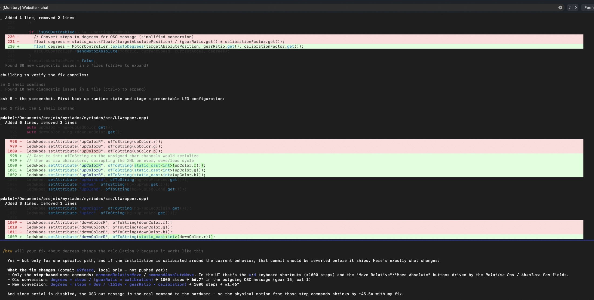

# Myriades Project - HourGlass LED Control System



An open source comprehensive control system for multi-hourglass LED installations built with openFrameworks. This application provides intuitive GUI controls and extensive OSC API support for managing LED effects, motor controls, and electromagnetic systems across multiple hourglass units.

## Features

### LED Control System
- **RGB LED Control**: Full color control for UP and DOWN LEDs on each hourglass
- **Effect Parameters**: Advanced blend, origin, and arc parameters for LED effects
- **Main LED Support**: Individual brightness control for main LEDs
- **Global & Individual Luminosity**: Dual-layer brightness control system
- **Gamma Correction**: Built-in gamma correction and minimum threshold optimization

### Motor Control
- **Precise Movement**: Absolute and relative angle positioning
- **Speed & Acceleration**: Configurable movement parameters
- **Motor Presets**: Pre-defined speed/acceleration combinations (slow, smooth, medium, fast)
- **Emergency Stop**: Safety controls for immediate motor shutdown
- **Gear Ratio Support**: Customizable gear ratios and calibration factors

### Electromagnetic Controls
- **PWM Control**: Variable electromagnetic field strength control
- **Independent Control**: Separate UP/DOWN electromagnet management

### OSC API
- **Multi-Targeting**: Support for single IDs, comma-separated lists (1,3), ranges (1-3), and "all"
- **Comprehensive Commands**: 40+ OSC commands for complete system control
- **Real-time Control**: Low-latency command processing and hardware communication

### User Interface
- **Multi-Hourglass Management**: Support for multiple connected hourglasses
- **Real-time Monitoring**: Connection status, OSC activity indicator, live LED preview
- **Parameter Sliders**: Intuitive controls for all LED and motor parameters
- **Preset Management**: Save and load motor configuration presets

## Quick Start

### Prerequisites
- **openFrameworks 0.12.1 or later** — older releases (0.11.x and earlier) link the
  `AGL` framework, which Apple removed from recent macOS SDKs (Xcode 15+). Building
  against an old OF fails with `ld: framework 'AGL' not found`. Download 0.12.1 from
  https://openframeworks.cc/download/ (or let `./setup_openframeworks_project.sh` do it).
- macOS (current build configuration)
- The app runs OSC-only (in on port 8000, out per `bin/data/hourglasses.json`)

### Building

Two supported layouts:

**A. Inside an openFrameworks tree (required for Xcode):**
```bash
cd <your-openframeworks-0.12.1>/apps/myApps
git clone https://github.com/martial/myriades.git
cd myriades

make Release            # or: open myriades.xcodeproj
```

**B. Anywhere on disk (make only):** clone wherever you like, then point
`config.make` at your OF install before building:
```make
OF_ROOT = /absolute/path/to/of_v0.12.1_osx_release
```
The Xcode project cannot use `OF_ROOT` — `Project.xcconfig` hardcodes
`OF_PATH = ../../..`, so Xcode builds only work with layout A.

### Running
```bash
# Run the built application
./bin/myriades.app/Contents/MacOS/myriades

# Or use the build script
./build_and_run.sh
```

### Troubleshooting

| Symptom | Cause / fix |
| --- | --- |
| `ld: framework 'AGL' not found` | Your openFrameworks is older than 0.12. Use OF **0.12.1+** (AGL no longer exists in current macOS SDKs). |
| Xcode: red/missing files, undefined symbols | Your checkout predates the project-file fix (2026-07-19) — pull latest `main`. `OSCOutController.cpp` was missing from the Xcode project and removed files were still referenced. |
| Xcode: `ofMain.h` not found | The repo is not inside `<OF>/apps/myApps/` (layout A above). |
| App text renders in a fallback bitmap font | `bin/data/fonts/JetBrainsMono-Medium.ttf` is missing — it ships in the repo; make sure `bin/data/` survived your checkout. |

## OSC API Examples

### Basic LED Control
```bash
# Set red color on all hourglasses
/hourglass/all/led/all/rgb 255 0 0

# Set blend effect on hourglasses 1 and 3
/hourglass/1,3/up/blend 400

# Set arc effect on hourglass range 1-3
/hourglass/1-3/down/arc 180
```

### Motor Control
```bash
# Rotate all hourglasses by 90 degrees
/system/motor/rotate/90

# Move hourglass 2 to absolute position 180°
/hourglass/2/motor/position/180/200/100

# Apply smooth preset to all hourglasses
/system/motor/preset smooth
```

### System Control
```bash
# Global blackout
/blackout

# Set global luminosity to 50%
/system/luminosity 0.5

# Emergency stop all motors
/system/emergency_stop_all
```

## Multi-Targeting Syntax

The system supports flexible targeting for LED, PWM, and connection commands:

- **Single ID**: `/hourglass/1/led/all/rgb 255 0 0`
- **Comma-separated**: `/hourglass/1,3,5/up/blend 200`
- **Range**: `/hourglass/1-4/down/origin 90`
- **All units**: `/hourglass/all/pwm/all 128`

## Project Structure

```
src/
├── OSCController.*         # Incoming OSC message handling and routing
├── OSCOutController.*      # Outgoing OSC to the hourglass hardware
├── HourGlassManager.*      # Multi-hourglass management
├── HourGlass.*             # Individual hourglass control
├── LedMagnetController.*   # LED and electromagnet command building
├── MotorController.*       # Motor movement and control
├── LedGeometry.h           # Shared LED arc math
├── VezerPlayer.*           # Vezér XML sequence playback (sequencer panel)
├── LEDVisualizer.*         # Live LED preview rendering
├── UIWrapper.*             # GUI interface and controls
├── OSCHelper.*             # OSC utility functions
└── ofApp.*                 # Main application entry point

docs/OSC_API.csv                 # Complete OSC command documentation
docs/OSC_API_Documentation.md    # Detailed API documentation
```

## Hardware Communication

The app is **OSC-only**: it receives control messages on port 8000 and relays
commands to the hourglass hardware as outgoing OSC (see
`docs/OSC_OUT_DOCUMENTATION.md`). Motor commands are sent 3x with 10 ms spacing
as a UDP-loss guard. The legacy serial/CAN transport was removed from this
codebase; `bin/data/hourglasses.json` still carries `serialPort`/`baudRate`
fields for compatibility, but they are unused.

## Open Source

This project is released under the MIT License, making it free to use, modify, and distribute. We welcome contributions from the community to help improve and extend the system's capabilities.

## Contributing

We welcome contributions to the Myriades Project! Here's how you can help:

1. **Fork the repository** on GitHub
2. **Create a feature branch** (`git checkout -b feature/amazing-feature`)
3. **Commit your changes** (`git commit -m 'Add amazing feature'`)
4. **Push to the branch** (`git push origin feature/amazing-feature`)
5. **Open a Pull Request**

### Development Guidelines
- Follow the existing code style and structure
- Add documentation for new features
- Test your changes thoroughly
- Update the OSC API documentation if adding new commands

## License

This project is licensed under the MIT License - see the [LICENSE](LICENSE) file for details.

## Technical Specifications

- **OSC Port**: 8000 (default, incoming)
- **LED Color Range**: 0-255 RGB
- **Motor Speed Range**: 0-500
- **Motor Acceleration**: 0-255
- **PWM Range**: 0-255
- **Effect Parameters**: Blend (0-768), Origin/Arc (0-360°)

## Support

For questions, bug reports, or feature requests, please open an issue on GitHub.

## Acknowledgments

Built with openFrameworks and ofxOsc addon for robust real-time multimedia control. This open source project is part of the Myriades initiative.